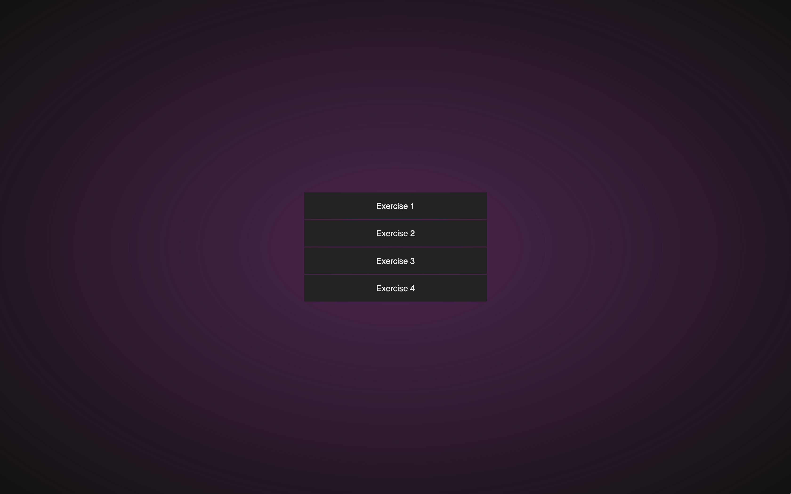
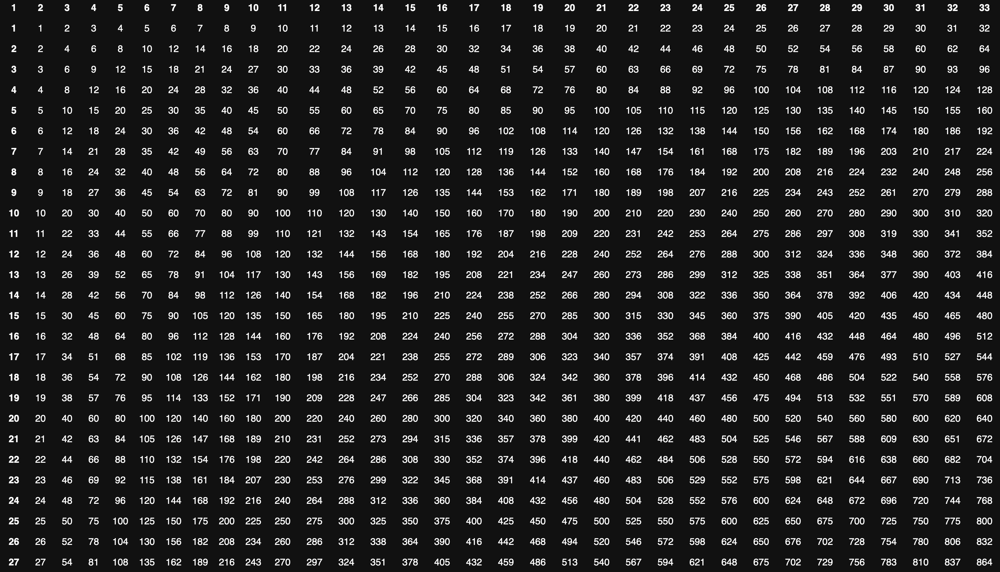
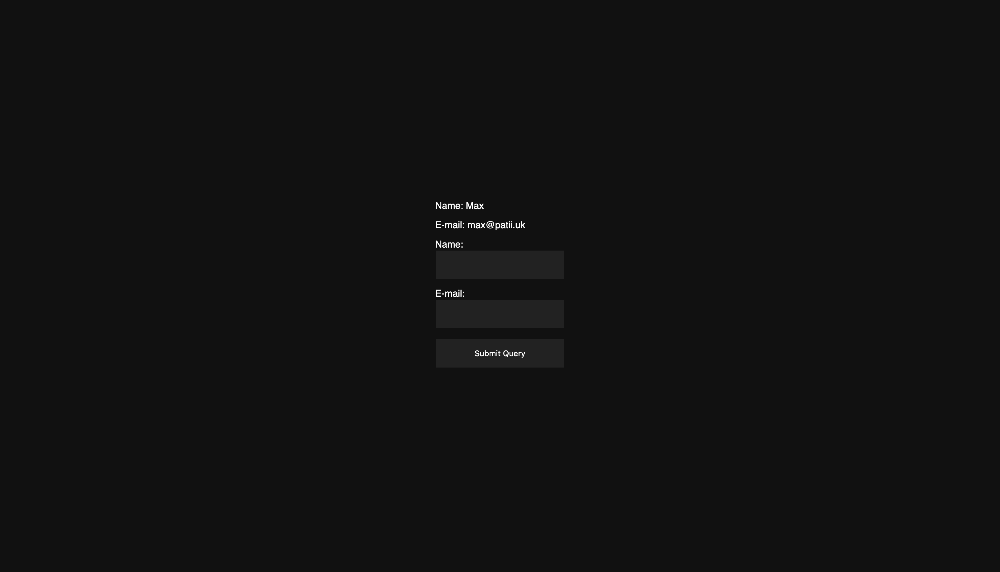
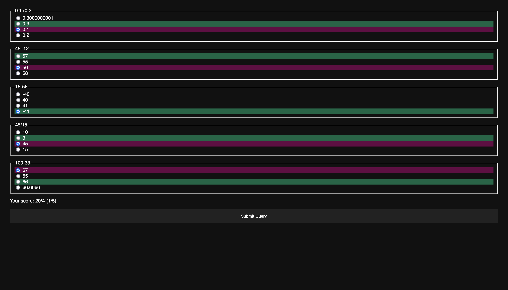
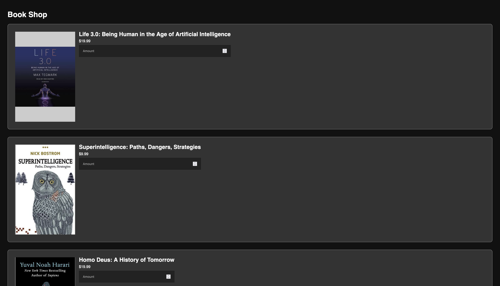

# EECS 448 Lab 09

Embarrassingly basic HTML stuff that I am forced to do for my college classes

## Overview

### Main Menu



### Exercise 1: Multiplication table



### Exercise 2: Basic POST request



### Exercise 3: Quiz



### Exercise 4: e-Bookstore



## Development

```zsh
npm i # install development dependencies
```

Open `./index.html` in your browser.

After making edits, refresh the page

## Production

Open `./index.html` in your browser.
